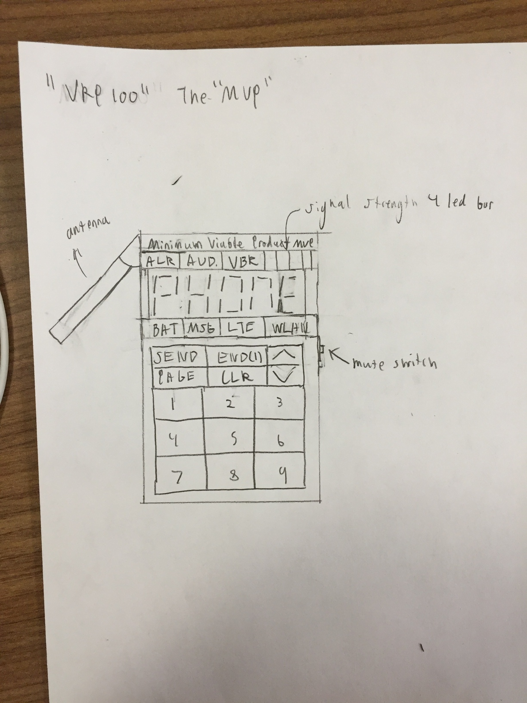
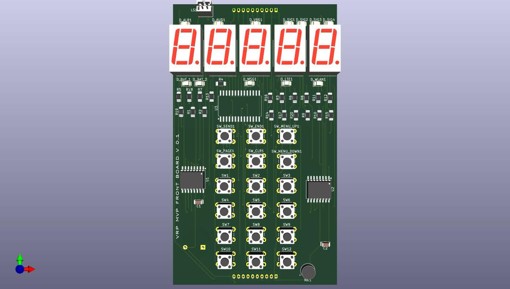

# The Minimum Viable Product Adaptation
The MVP is the reference adaptation for the VRP projetc. It is currently in development alongside the rest of the VRP project.

## Description

```
VoLTE Retrofit Project Minimum Viable Product (VRP MVP)

Overview:
	The MVP is a fully custom feature phone based around the VRP platform. From a user facing perespective it is similar to cellphones from the 80s and early 90s (think Motorola Bag Phone or MicroTac). The form factor is inspired by the light phone and 90s japanese consumer elctronics. This display is the most striking feature, instead of a tradional dot matrix LCD it uses 5 discreet 7 segment displays along dedicated status LEDs for major functions. 


Core Feartures:
	- earpiece
	- flip out antenna ("becuase why not")
	- headphone jack with mic input
	- vibration motor
	- 5 character 7 segment display
	- LED indicator lights
	- Raspberry Pi Zero W SBC
	- Quectel EG25-G LTE modem with VoLTE
	- VRP software stack with web interface

```






